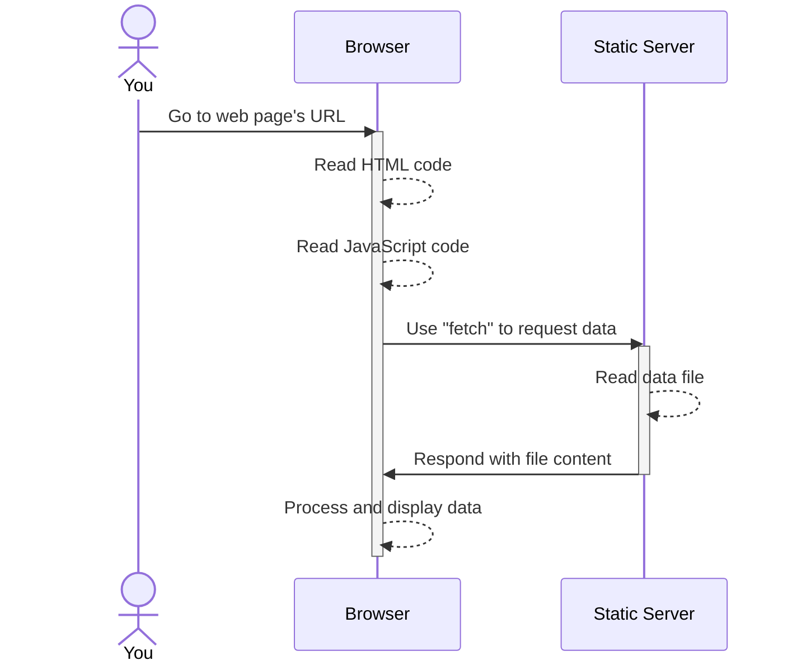
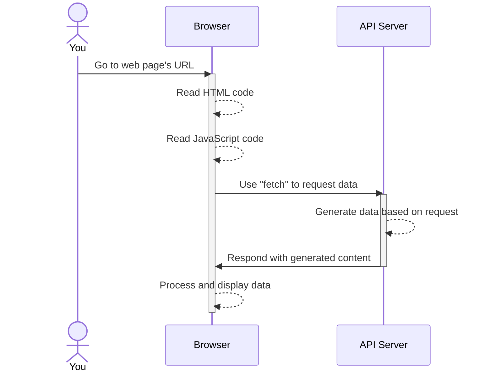

# Review

## API Services

We've seen one Mapbox API in action. There are others: https://docs.mapbox.com/api/overview/.

We can also create our own simple API services. These can be read-only, but often it is helpful to create read/write services as well, in order to build upon data that exists elsewhere.

## Web APIs

There are a ton of useful web APIs built into most browsers. In this repository there are examples demonstrating [`geolocation`](webapis/geolocation) and [`localStorage`](webapis/localstorage), but there are many others: https://developer.mozilla.org/en-US/docs/Web/API.

### Challenge!

Use [Turf.js](https://turfjs.org/) and the [`geolocation` Web API](https://developer.mozilla.org/en-US/docs/Web/API/Geolocation_API) to allow the user of the canvass app to locate themselves, and then determine automatically which division they are in.

> HINT: The [`booleanContains`](https://turfjs.org/docs/#booleanContains) function might be useful, and you can find a GeoJSON file of the divisions (precincts) in Philadelphia at https://opendataphilly.org/dataset/political-ward-divisions/resource/f222a53a-6cb5-4cfc-8f26-c9ba5c669336.

## Map tiles

You can use services such as Mapbox to create custom tiles. You might want to create custom tiles when there's some data that you want to include on your map styled in specific and non-trivial ways, and you don't need that data to be interactive.

You can [use your custom tiles in Leaflet](https://docs.mapbox.com/studio-manual/guides/publish-your-style/#mapboxjs-and-leaflet), or you can use them with other mapping libraries such as [Mapbox GL JS](https://docs.mapbox.com/studio-manual/guides/publish-your-style/#mapboxjs-and-leaflet) (Mapbox has a rich set of [tutorials](https://docs.mapbox.com/help/tutorials/?product=Mapbox+GL+JS) and [examples](https://docs.mapbox.com/mapbox-gl-js/example/) for doing so).

## Requesting data using `fetch`

_index.html:_
```html
<!DOCTYPE html>
<html>
  <head>...</head>
  <body>
    ...
    <script src="main.js"></script>
  </body>
</html>
```

_main.js:_
```js
const url = `...`;

// Use "fetch" to request data file
fetch(url)
  .then(resp => resp.json())
  .then(data => {
    // Process and display data
    ...
  });
```



Using `fetch` to request data from an API is an inherently similar process. The server may do something different than just read a file, but that doesn't matter; it's all going to look the same to you.



## Layouts

I posted a video about mimicking a scrolling story map on YouTube at https://youtu.be/HU8-Hu24Qu4. Remember that everything on a page is boxes.

A few references:
- [What's the Difference Between Flexbox and Grid?](https://css-tricks.com/quick-whats-the-difference-between-flexbox-and-grid/) (CSS Tricks)
- Deciding between [Grid and Flexbox](https://developer.mozilla.org/en-US/docs/Web/CSS/CSS_Grid_Layout/Relationship_of_Grid_Layout#grid_and_flexbox) layouts (MDN)
